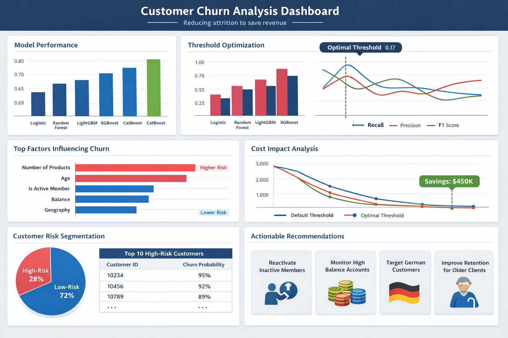

<h2>Project Summary</h2>
<h3>Customer Churn Prediction & Business Optimization</h3>
<h3>🎯 Project Objective</h3>

The objective of this project was to build a predictive machine learning system to identify customers likely to churn and translate model predictions into financially optimized business decisions.

Rather than focusing only on accuracy, the project emphasizes:

Model performance comparison

Threshold optimization

Financial cost minimization

Model explainability (SHAP)

Business-driven decision making

<h3>🧠 Data Overview</h3>

The dataset contains customer-level banking information including:

Demographics (Age, Gender, Geography)

Financial indicators (CreditScore, Balance, EstimatedSalary)

Behavioral metrics (Tenure, NumOfProducts, Points Earned)

Engagement indicators (IsActiveMember, Satisfaction Score)

Target variable: Exited (1 = churn, 0 = retained)

Churn rate is imbalanced (~20%), so stratified sampling and appropriate evaluation metrics were used.

<h3>🤖 Models Implemented</h3>

The following models were trained and evaluated:

Logistic Regression

Random Forest

XGBoost

LightGBM

CatBoost

Evaluation metric: ROC-AUC (primary metric for imbalanced classification)

After comparison, CatBoost achieved the highest ROC-AUC score, making it the final selected model.

<h3>📊 Threshold Optimization (Performance-Based)</h3>

For each model, classification thresholds were tuned to balance:

Recall

Precision

F1-score

For CatBoost, the F1-optimal threshold differed from the default 0.5, demonstrating that:

Model performance depends heavily on decision threshold selection.

<h3>💰 Business Cost Simulation (Financial Optimization)</h3>

Instead of using a fixed threshold (0.5), a cost-sensitive analysis was performed.

Assumptions:

Missed churner (FN) cost = $500

Retention campaign (FP) cost = $100

A threshold sweep (0.00 → 1.00) was conducted.

<h3>🔥 Result:</h3>

Financially optimal threshold = 0.17

This threshold significantly reduced total business loss compared to 0.5.

Business Interpretation:

Missing a churner is 5x more expensive than contacting a loyal customer.

Therefore, increasing recall is financially justified.

Lowering the threshold increases churn detection and minimizes revenue loss.

This demonstrates real-world, business-aligned model deployment thinking.

<h3>🔍 SHAP Explainability (Model Transparency)</h3>

To understand model decisions, SHAP analysis was performed on the CatBoost model.

📌 Top Churn Drivers Identified:

NumOfProducts

Age

IsActiveMember

Geography (Germany)

Balance

Satisfaction Score

CreditScore

<h3>💼 Key Business Insights from SHAP</h3>

Inactive members have significantly higher churn risk.

Customers with high balances show elevated churn probability — financially dangerous segment.

Customers in Germany exhibit higher churn behavior.

Lower satisfaction strongly drives churn.

Older customers display increased churn probability.

Certain product count patterns increase churn likelihood.

🏦 Strategic Business Recommendations

Based on model predictions and SHAP analysis:

🎯 1. Target Inactive Customers

Launch engagement campaigns for inactive members.

💰 2. Protect High-Balance Customers

Implement premium retention programs for high-value customers.

🌍 3. Regional Strategy for Germany

Investigate localized dissatisfaction and improve competitive positioning.

😊 4. Improve Satisfaction Programs

Monitor low satisfaction scores as early churn warning signals.

👥 5. Early Tenure Intervention

Provide onboarding and engagement incentives for new customers.

<h3>🏁 Final Conclusion</h3>

The CatBoost model, optimized with a financially-driven threshold of 0.17, provides a practical and deployable churn prediction system.

By aligning model predictions with real-world cost structures, the bank can:

Reduce revenue loss

Improve retention efficiency

Allocate marketing budget more effectively

Make explainable, data-driven decisions
